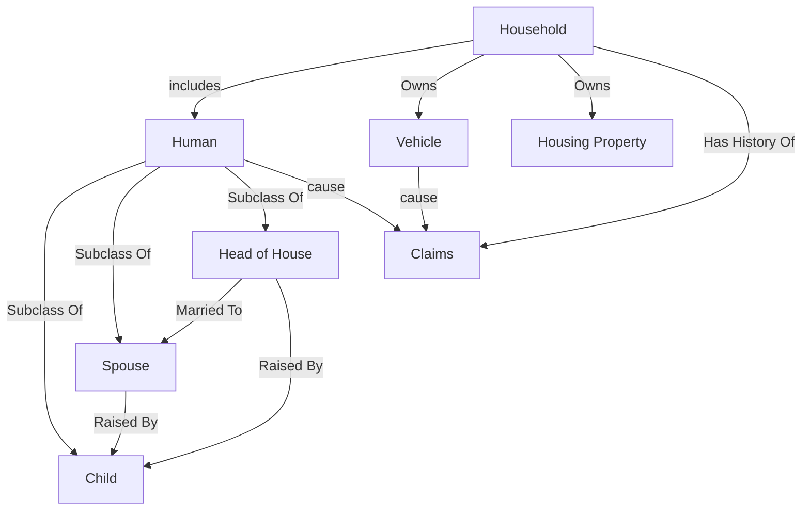

# Data Generator

A main challenge in this project is finding appropriate data. The type of data that would ideally be used is not freely available publicly. For that reason, we decided to instead make synthetic data. This folder of the project captures the python scripts used to build that data.

## Entity-Relationship Diagram 

## High Level Class Structure

## To Do  

- [x] Rebalance the driver hazard attribute to be normally distributed  
- [x] Rebalance relationship between risk scores
- [x] Add process to determine vehicle preference for each driver
- [x] Add process for assigning drivers to vehicles
- [x] Add process for prorating mileage to vehicles based on assignments
- [x] Add process for a household buying cars  
- [x] Add process for a household selling/losing cars  
- [ ] Looks back at household finances
- [x] Add process for determining how many miles each person drives  
- [x] Confirm spouse age process is working right
- [x] Add process for agging vehicles
- [ ] Add process for populating years own at new business time
- [ ] Add process for household picking insurance coverages  
- [ ] Add "insurance coverage at the time" to claims data  
- [ ] Write coverage specific logic for determining when claims occur  
- [ ] Figure out how subsequent loss fields should be marked
- [ ] Build way to export data to Weights & Bias  
- [ ] Build way to export data at multiple levels (household, vehicle, all claims, etc) 
- [ ] Write metadata on all fields  
- [ ] Run code profiler and figure out if anything is running too much
